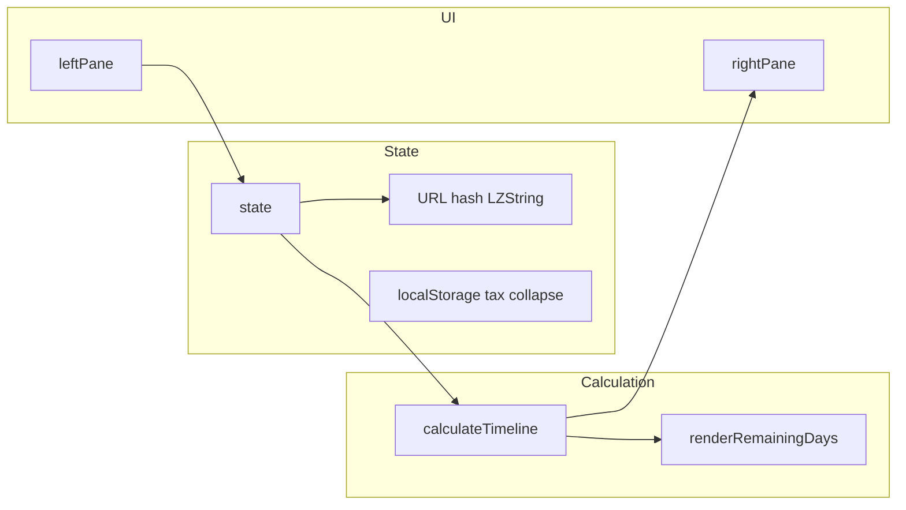

# AGENTS.md — parplan

**Start here** when working on this repository in an agent or automated context.

## 1. Project snapshot

- **Name:** Föräldrapenning Planner (parplan)
- **Purpose:** Plan parental leave for **two parents** in Sweden. Day pools, **ledighetsregler**, **årskalender** (manual FP adjustments + semester), income/tax estimates, and a **suggested yearly plan** for remaining days are based on **Försäkringskassan-style** limits encoded as constants (aligned with **2026** in code and tax dataset year).
- **Codebase shape:** Almost everything is in a single file: [`index.html`](index.html) (Tailwind via CDN, LZ-String, inline JavaScript). **No build step.** Other tracked files: [`.gitignore`](.gitignore), [`README.md`](README.md) (short intro + link here), and this file.

## 2. State and persistence

| Mechanism | What it stores |
|-----------|----------------|
| In-memory `state` | Children, parents (salary, tax fields, top-ups), **leave rules** (`state.rules`), yearly plans, per-child used days, `calendarVacation`, `calendarParentalOverrides`, etc. Initialized from `defaultState()` and merged on load. |
| URL hash + LZString | **Primary shareable state.** `saveState()` serializes `state` to JSON, compresses with LZString, writes `history.replaceState` with `#<compressed>`. `loadState()` reads `location.hash` and merges into `state`. |
| `localStorage` `skv_*` | Cached Skatteverket kommuner/tabell data (TTL ~7 days). See `cacheGet` / `cacheSet` in `index.html`. |
| `localStorage` `parplan_collapsedSections` | JSON array of collapsible section ids that are **closed**; restored on load so `
` state survives reloads. |

## 3. UI architecture

### Layout

- Container: `max-w-[1920px]`, padded; on `lg+` the page uses `h-screen` / `overflow-hidden` so only the panes scroll (no extra page scrollbar).
- **Two panes:** `#left-pane` (config), `#right-pane` (results).
- Responsive: `flex-col` below `lg`, `lg:flex-row` side-by-side; each pane scrolls (`overflow-y-auto`, `flex-1 min-h-0`).

### Collapsible sections

- Helper: `collapsible(id, title, summary, content)` → `
` with header title + one-line summary.
- Global `collapsedSections` (`Set`); `toggle` listener updates set and calls `saveCollapsedState()`.
- Section ids are stable strings (e.g. `children`, `yearly-plans`, `remaining-days`).

### Pane content order

**Left (config), top to bottom:**

1. Barn — `renderChildren()`
2. Föräldrar — `renderParents()`
3. Dagpool / använda — `renderChildSetup()`
4. Ledighetsregler — `renderRules()`
5. Dagar per år (kvarvarande) — `renderYearlyPlans()` (extracted from remaining-days; **not** embedded in suggested plan body)
6. Årskalender (semester) — controls in left pane; full grid in right pane

**Right (results), top to bottom:**

1. Varningar — `renderWarnings(timeline.warnings)` (first, so errors stay visible)
2. Årskalender — `renderYearCalendarMain(timeline)` (painted vacation + overrides; stats use the same `timeline` as the rest of the app)
3. Dagsaldo — `renderDayBalance(timeline.consumed)`
4. Månadsöversikt — `renderTimeline(timeline.months)`
5. Kvarvarande dagar — `renderRemainingDays(timeline.consumed, timeline.months)` (includes yearly plan UI)

### Render pipeline

- `renderAll()`: sorts `state.rules` and `state.yearlyPlans`; **`beginRenderCycle()`** builds per-render caches (vacation sets, child ids, **`deriveParentalFromRules(year)`** via `derivedByYear`, holiday maps); runs **`calculateTimeline()` once**; sets `left-pane` / `right-pane` from **`renderConfig(timeline)`** / **`renderResults(timeline)`**; **`endRenderCycle()`** clears caches.
- FP assignment: **`resolveParentalAssignment`** merges **`deriveParentalFromRules`** (from rules) with **`calendarParentalOverrides`**.
- `computeYearCalendarStats(year, timeline)` takes the precomputed timeline (no second `calculateTimeline()` per year).
- If there are no timeline months, results show **Varningar** first, then Årskalender, then a collapsible empty-state message (no dagsaldo / månadsöversikt / kvarvarande blocks).

## 4. Core computation

### `calculateTimeline()` (see `index.html`)

- Orchestrates **`computeTimelineDateRange()`** (min/max dates), **`buildMonthRange()`**, **`initConsumedFromChildren()`**, then per month **`computeParentMonth(pi, …)`** (mutates `consumed` and top-up month counters). Helpers: **`extendDateRange`** for date bounds.
- Date range sources: **children `birthDate`**, **`state.rules`** (start/end), **`calendarParentalOverrides`** date keys, and **`calendarVacation`** segments.
- For each month and each parent, resolves FP per day from derived rules + overrides + vacation mask → leave days and income; allocates **sjukpenning** vs **lägstanivå** per child using shared pool remaining (`getSharedPoolRemaining`, `consumed`).
- **Output:** `{ months, consumed, warnings }`
  - `consumed[childId][parentIndex]` → `{ sjuk, lagsta }` cumulative.
  - Each month: `{ year, month, parents: [ { leaveByChild, leaveDays, income fields, ... }, ... ] }` where `leaveByChild[childId] = { sjuk, lagsta }` for that parent that month.

### `FK` constants object

Central limits (examples — see `index.html` for full list):

- `SJUK_DAYS_TOTAL`, `LAGSTA_DAYS_TOTAL`, per-parent caps
- `RESERVED_SJUK`, `FIRST_SJUK_REQUIREMENT`
- `SAVE_LIMIT_4YR` (split between “must use before age 4” vs “saveable to age 12”)
- `LAGSTA_DAILY`, sjuk daily min/max caps, `PRISBASBELOPP`, etc.

**When changing Swedish rules:** update `FK` and trace callers (`calculateTimeline`, remaining-days pools, warnings).

### Tax data

- `SKV_KOMMUN_URL`, `SKV_TABELL_URL`, `TAX_YEAR` (2026) — Skatteverket rowstore APIs; kommuner/församlingar drive tabell lookup and optional net salary in timeline.
- Failed kommuner load sets **`taxKommunerError`** and shows retry via **`actions.retryTaxKommuner()`** in the tax fields UI.

## 5. Yearly plan (Remaining Days section) — product rules

This block is **not** the same as the monthly timeline: it suggests how to spread **remaining** parental benefit days across future years, then **merges** with days already implied by the **timeline** (rules + calendar overrides).

### Combined display: “Yearly plan (leave rules + suggested)”

- **(A) Timeline (regler/kalender):** Per calendar year, sum `timeline.months` → both parents’ `leaveByChild` → total sjuk + lagsta per child (and aggregate `rulesTotal`, `rulesSjuk`, `rulesLagsta` for the year in UI code).
- **(B) Suggested:** Distribution of remaining pool days (planned yearly entries + “before age 4” + “before age 12” pools) into month slots, then rolled up by year.
- **UI:** One row per year with **total = (A) + (B)**; stacked bar — **slate** = timeline (rules/calendar), **blue** = suggested sjukpenning, **amber** = suggested lägstanivå. Expand for per-child breakdown and “Suggested from: …”.

### Suggested distribution (internal)

- Implementation is split into helpers (see `index.html`): **`buildRemainingPools`**, **`buildRemainingMonthSlots`**, **`mergeYearlyPlansIntoMonthSlots`**, **`deductPlannedFromRemainingPools`**, **`distributeRemainingPoolsToMonthSlots`**, **`foldRemainingMonthSlotsToYearSlots`**, **`assignSjukLagstaToYearSlots`**, **`mergeCalendarRulesIntoYearSlots`**; **`renderRemainingDays`** composes them and renders HTML.
- **Month-based internally, year-based in the UI:** `monthSlots` from `planStart` (latest **`state.rules[].end`** vs “now”) through the relevant year range (includes any year appearing in planned yearly leave).
- **Full vs partial years:** A calendar year is “full” for a pool if the entire year lies in `[poolStart, poolEnd]`. The pool’s days are split between full-year weight and partial-year weight; **full years** get a dedicated share, then **partial** months get the rest proportional to **segment day counts** (intersection of month with pool window).
- **Evenness across years:** For the full-year portion of a pool, per-year amounts are chosen so **resulting year totals** (including days already placed from **earlier** pools in the same loop) are as balanced as possible — not simply `poolDays / numFullYears` ignoring other children’s earlier allocations.
- **“Suggested from” line:** Multiple sources with the same `(child, label)` are **aggregated** (days summed) before display.

### Planned yearly leave interaction

- Years that have at least one planned entry: **every month** in that calendar year is marked `fixed` so **no** suggested pool days are placed there.
- Planned days are attached to the **first month slot that exists** for that year (handles `planStart` mid-year — not always January).
- **Deduction:** Total planned days are subtracted from pool `days` (generic deduction loop) before distributing the rest.

### Pool definitions (remaining days)

- Pools are built per child from remaining sjuk/lagsta vs `FK` limits; split into:
  - **“before age 4”** — must use beyond saveable limit; deadline = 4th birthday.
  - **“before age 12”** — saveable portion; deadline = 12th birthday.
- **Window start:**
  - **Before age 4:** `poolStart = planStart` (same as timeline planning start).
  - **Before age 12:** `poolStart` = that child’s **age-4 date** (`windowStart` on pool) — do **not** place “before 12” days in months before the child turns 4.

### Cross-child priority (before 12 vs before 4)

- Compute **`latestBefore4Deadline`** = max deadline among all **“before age 4”** pools.
- **“Before age 12”** pools only use month slots with **`monthStart > latestBefore4Deadline`**, so another child’s flexible days are not placed in years where any child still has urgent “before age 4” time left.

## 6. External dependencies

- **Tailwind CSS** — CDN script in `index.html`.
- **LZ-String** — compression for URL state.
- **Skatteverket** rowstore URLs — kommuner and tax tables (`SKV_*` constants).

## 7. Conventions for future changes

1. Prefer editing [`index.html`](index.html) unless you intentionally split the app.
2. After changing **timeline**, **warnings**, or **yearly plan** behavior, update **this file** in the same change set so agents stay aligned.
3. User-controlled strings in HTML must go through **`esc()`** to avoid XSS.
4. New collapsible sections: pick a **stable `id`**, add summary helper if needed, include in `renderConfig` or `renderResults` as appropriate.

## 8. Quick reference — key symbols

| Symbol | Role |
|--------|------|
| `state` | Application data |
| `mutate(fn)` | Runs `fn()`, then `saveState()` + `renderAll()` (most `actions.*` handlers) |
| `freshUsedDays()` | Returns a fresh `[{ sjuk, lagsta }, …]` default for `usedDays` |
| `PARENT_COLORS` / `pc(pi, key)` | Shared parent palette (`main`, `bg`, `border`, `light`, `bar`) |
| `calculateTimeline` | Rules + calendar overrides + vacation → months + consumed + warnings |
| `renderRemainingDays(consumed, months)` | Pools, month distribution, yearly rows + rules merge |
| `renderConfig` / `renderResults` | Left / right pane HTML |
| `actions` | User event handlers (mostly via `mutate`) |
| `FK` | Försäkringskassan-style numeric limits |

## 9. Diagram (high level)

